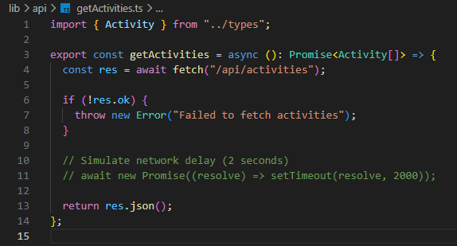
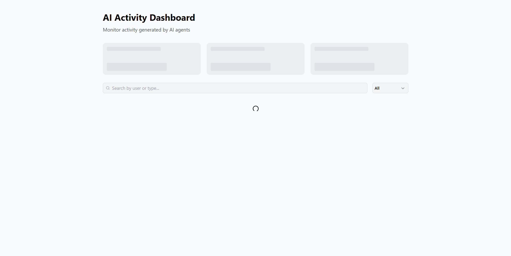

# AI Agents Dashboard

A frontend application for monitoring AI agent activities in real time.

## Tech Stack

- [Next.js](https://nextjs.org/)
- [TypeScript](https://www.typescriptlang.org/)
- [Tailwind CSS](https://tailwindcss.com/)
- [React Query](https://tanstack.com/query) — server state management & caching
- [shadcn/ui](https://ui.shadcn.com/) — UI component library

## Getting Started

```bash
git clone https://github.com/NikaPanchulidze/ai-agents-dashboard.git
cd ai-agents-dashboard
npm install
npm run prod
```

## Project Structure

```
├── app/
│   ├── api/
│   │   └── activities/
│   │       └── route.ts          # AI agent data API route
│   ├── dashboard/
│   │   └── page.tsx              # Main dashboard page
│   └── layout.tsx                # Root layout
├── components/
│   ├── ui/                       # shadcn/ui generated components
│   ├── ActivityFilters.tsx       # Filter controls for activity table
│   ├── ActivityModal.tsx         # Activity detail modal
│   ├── ActivityTable.tsx         # Main data table
│   ├── StatCard.tsx              # Individual stat display card
│   └── StatCardsSkeleton.tsx     # Loading skeleton for stat cards
├── hooks/
│   └── useActivities.ts          # React Query hook for activity data
├── lib/
│   ├── api/
│   │   └── getActivities.ts      # API fetch function
│   ├── types.ts                  # Shared TypeScript types
│   └── utils.ts                  # Utility functions
├── providers/
│   └── query-provider.tsx        # React Query client provider
└── styles/
    └── globals.css
```

## Simulating a Longer Loading State

To test loading skeletons and async UI behavior:

1. Open `lib/api/getActivities.ts`
2. Uncomment the artificial delay line (shown below)

> **Note:** If using `npm run prod`, you must restart the server after making this change for it to take effect.





## Assumptions

- All activity data is fetched from a client-side API endpoint via the useActivities hook.
- Filtering and sorting are handled client-side given the static data size.

## What I Would Improve With More Time

- Add debounced search to improve performance with large datasets.
- Integrate pagination or infinite scrolling for better scalability.
- Filtering and searching would happen on server side.
